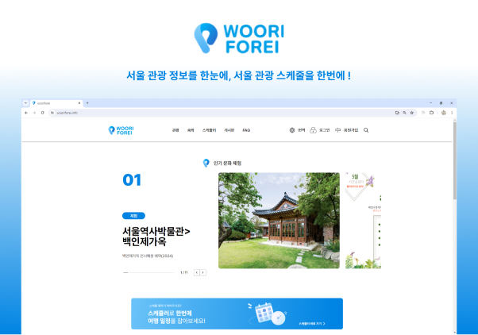
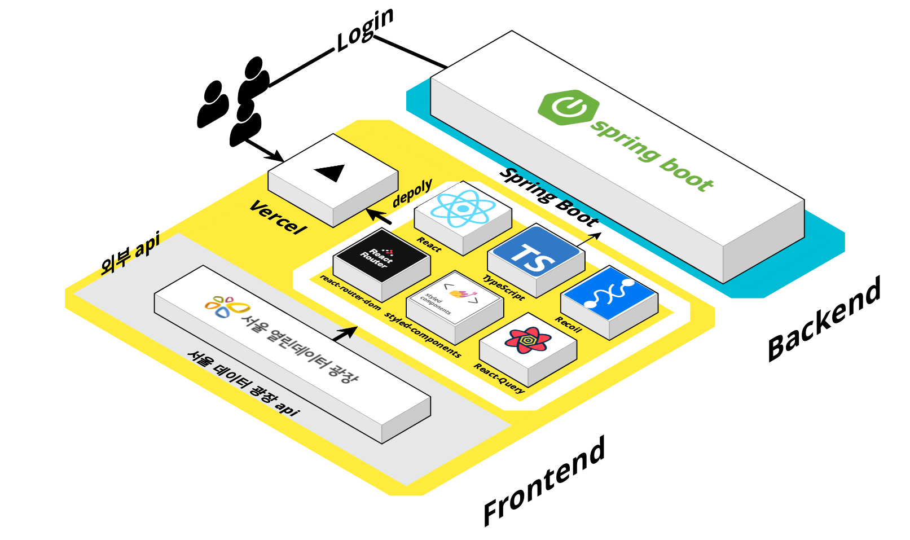
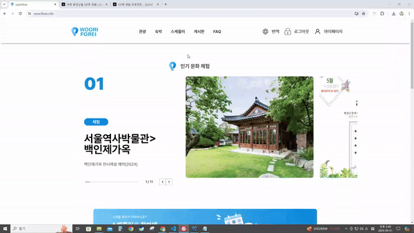
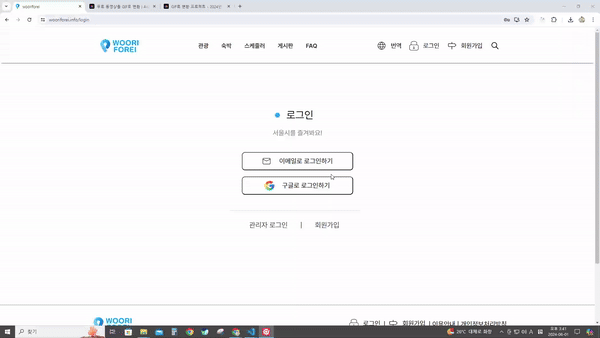
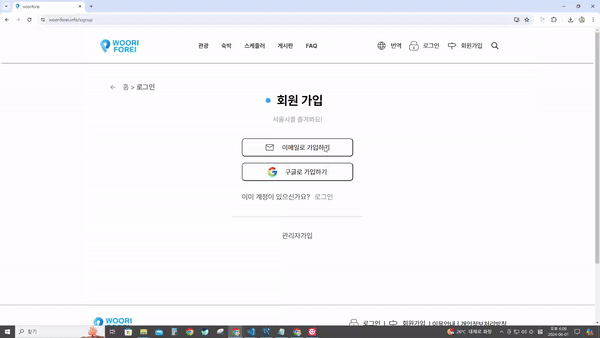

<h1>서울 관광 정보 페이지</h1>

### 1. wooriforei

 
서울 관광 정보를 제공하고, 관광 스케줄을 만들 수 있는 페이지

---

### 2. 서비스 아키텍처

---

### 3. 기술스택

💻 Environment

   

💾 Database

🚀 Frameworks & Library

         

💬 Communication

  

---

### 4. 주요 기능

서울 관광정보 제공 및 여행 스케줄러 생성

- <b>메인 페이지</b>  
    
- <b>서울 명소 및 체험, 맛집, 기념품,숙박 업소 조회 및 검색</b>  
     
- <b>스케줄러</b>  
    
- <b>게시판 & FAQ</b>  
    
- <b>로그인</b>  
    
- <b>회원가입</b>  
  
